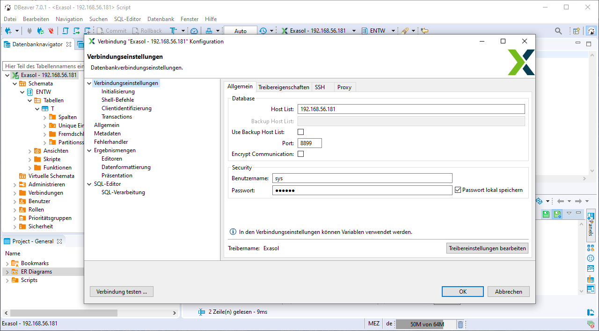

# exasol-testing-environment

[Exasol](https://www.exasol.com/) testing environment in a Vagrantbox based on Debian and provisioned with Ansible.

## Requirements

- Virtualbox >= 6.1
- Vagrant >= 2.0.7
- Vagrant Plugins:
  - vagrant plugin install vagrant-hostmanager
  - vagrant plugin install vagrant-vbguest

## Getting started

1. git clone https://github.com/neikei/exasol-testing-environment.git
2. cd exasol-testing-environment
3. vagrant up
4. ... wait ...

## Initial credentials

The initial credentials are required for the access to the Exasol database and shown during the provisoning.

```bash
TASK [exasol : Connection information and credentials] *************************
ok: [default] => {
    "msg": "Host: 192.168.56.181 Port: 8899 User: sys Password: exasol"
}
```

## Example data

Exasol provides a [Public Demo Hands-on Guide](https://docs.exasol.com/get_started/publicdemo/setupguide.htm).

## Screenshot

Connection via DBeaver.



## Feedback, Issues and Pull-Requests

Feel free to report issues, fork this project and submit pull requests.
